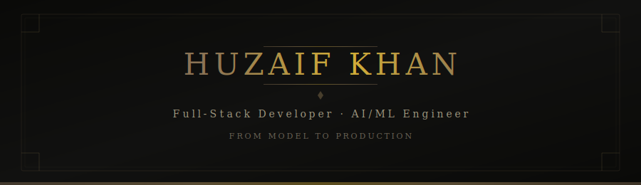

<div align="center">

<!-- Custom Banner -->


<br>

<!-- Typing Animation -->
<a href="https://git.io/typing-svg"></a>

<br>

<!-- Social -->
[](https://linkedin.com/in/YOUR-LINKEDIN)
&nbsp;&nbsp;
[](mailto:huzaiffkhhan@gmail.com)
&nbsp;&nbsp;
[](https://github.com/Huzzzaif)

</div>

<br>

## About

```python
class HuzaifKhan:
    role       = "Full-Stack Developer × AI/ML Engineer"
    location   = "Los Angeles, CA"
    education  = "Computer Science"
    
    languages  = ["Python", "JavaScript", "C", "SQL"]
    ml_stack   = ["TensorFlow", "PyTorch", "Scikit-learn", "OpenCV", "NLP"]
    web_stack  = ["React", "Node.js", "REST APIs", "HTML/CSS"]
    devops     = ["Docker", "Git", "Linux"]
    interests  = ["Reinforcement Learning", "LLMs", "Blockchain (ZKP)"]
    
    currently  = "building AI-powered apps & looking for my next role"
```

<br>

## Tech Stack

<div align="center">
<table>
<tr>
<td align="center" width="110">

<br><sub><b>Python</b></sub>
</td>
<td align="center" width="110">

<br><sub><b>JavaScript</b></sub>
</td>
<td align="center" width="110">

<br><sub><b>C</b></sub>
</td>
<td align="center" width="110">

<br><sub><b>TensorFlow</b></sub>
</td>
<td align="center" width="110">

<br><sub><b>PyTorch</b></sub>
</td>
<td align="center" width="110">

<br><sub><b>Scikit-learn</b></sub>
</td>
</tr>
<tr>
<td align="center" width="110">

<br><sub><b>React</b></sub>
</td>
<td align="center" width="110">

<br><sub><b>Node.js</b></sub>
</td>
<td align="center" width="110">

<br><sub><b>Docker</b></sub>
</td>
<td align="center" width="110">

<br><sub><b>Git</b></sub>
</td>
<td align="center" width="110">

<br><sub><b>Linux</b></sub>
</td>
<td align="center" width="110">

<br><sub><b>OpenCV</b></sub>
</td>
</tr>
</table>
</div>

<br>

## Featured Work

<div align="center">
<table>
<tr>
<td width="50%">
<h3 align="center">🧬 NLP Cancer Prediction</h3>
<p align="center">
<a href="https://github.com/Huzzzaif/nlp-cancer-prediction">

</a>
</p>
<p align="center">NLP pipeline that predicts cancer from clinical text using deep learning</p>
<p align="center">


</p>
</td>
<td width="50%">
<h3 align="center">🏥 Medical Prediction App</h3>
<p align="center">
<a href="https://github.com/Huzzzaif/medical_pred_frontend">

</a>
</p>
<p align="center">Full-stack React app serving a trained ML model for medical predictions</p>
<p align="center">


</p>
</td>
</tr>
<tr>
<td width="50%">
<h3 align="center">💰 Finance Bot</h3>
<p align="center">
<a href="https://github.com/Huzzzaif/finance_bot">

</a>
</p>
<p align="center">AI-powered financial assistant for intelligent analysis</p>
<p align="center">


</p>
</td>
<td width="50%">
<h3 align="center">🔐 ZKP Blockchain × LLM</h3>
<p align="center">
<a href="https://github.com/Huzzzaif/zkp-blockchain-llm-sim">

</a>
</p>
<p align="center">Zero-knowledge proof blockchain simulation with LLM integration</p>
<p align="center">


</p>
</td>
</tr>
<tr>
<td width="50%">
<h3 align="center">🎭 See The Tone</h3>
<p align="center">
<a href="https://github.com/Huzzzaif/see_the_tone">

</a>
</p>
<p align="center">Real-time sentiment & tone analysis powered by NLP</p>
<p align="center">


</p>
</td>
<td width="50%">
<h3 align="center">🤖 AI Virtual Assistant</h3>
<p align="center">
<a href="https://github.com/Huzzzaif/AI-Powered-Virtual-Assistant">

</a>
</p>
<p align="center">Intelligent virtual assistant with natural language understanding</p>
<p align="center">


</p>
</td>
</tr>
</table>
</div>

<br>

<div align="center">


<br>

<sub>Open to opportunities — <a href="mailto:huzaiffkhhan@gmail.com">let's connect</a></sub>

</div>

<br>


